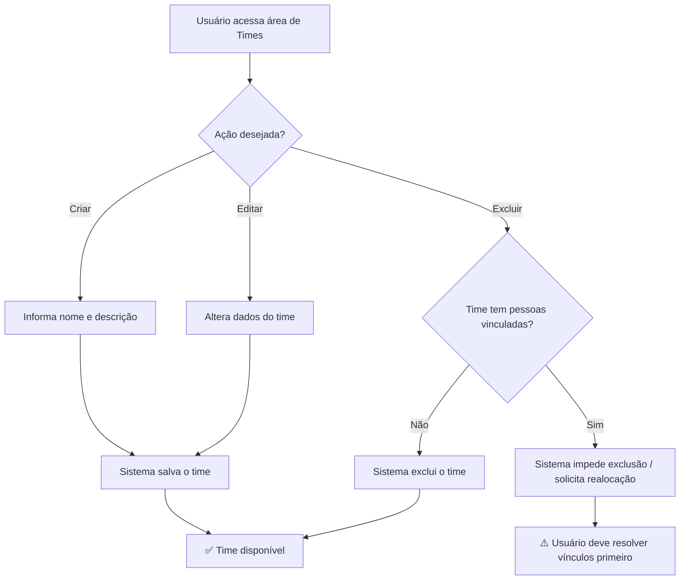
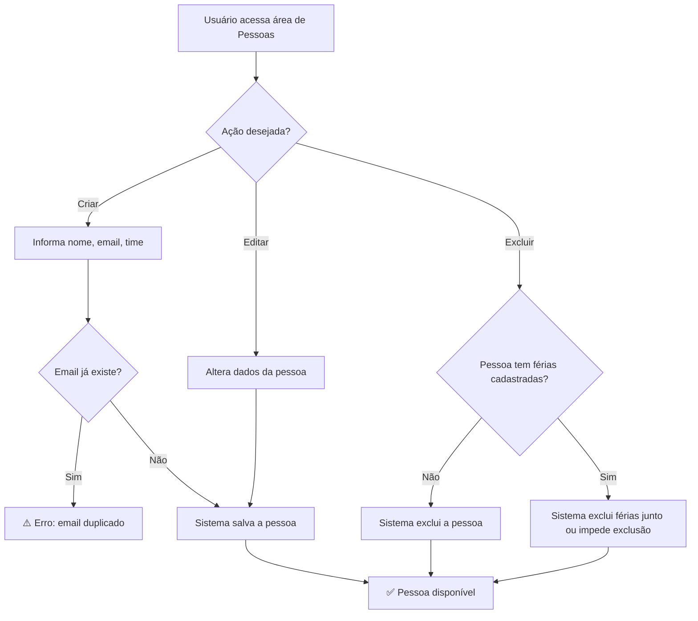
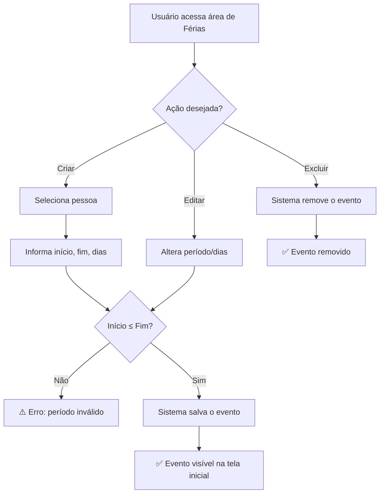
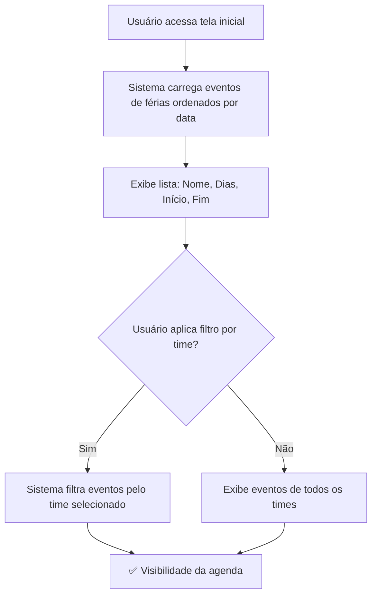

# Processos de Negócio — ferias

> **Artefato RUP:** Modelo de Processos de Negócio (Modelagem de Negócios)
> **Proprietário:** [RUP] Analista de Negócios (📋)
> **Status:** Completo
> **Última atualização:** 2026-07-17

---

## Visão Geral dos Processos

O sistema suporta 4 processos de negócio macro:

| ID | Processo | Gatilho | Resultado |
|----|----------|---------|-----------|
| BP-01 | Gestão de Times | Necessidade de organizar pessoas em agrupamentos | Time cadastrado e disponível para vincular pessoas |
| BP-02 | Gestão de Pessoas | Nova pessoa entra no time ou precisa ser cadastrada | Pessoa registrada e vinculada a um time |
| BP-03 | Registro de Férias | Pessoa agenda suas férias ou líder registra ausência | Evento de férias visível na tela inicial |
| BP-04 | Consulta de Férias | Alguém precisa saber quem está ou estará de férias | Visualização filtrada dos eventos de férias |

---

## BP-01: Gestão de Times

**Gatilho:** Um novo time precisa ser cadastrado, ou um time existente precisa ser alterado/removido.

**Atores:** Qualquer usuário do sistema.

**Passos:**
1. Usuário acessa a área de times
2. Usuário cria um novo time (nome + descrição) ou edita/exclui um existente
3. Sistema persiste a alteração

**Resultado:** Time disponível para vincular pessoas.

**Referências:** BR-008, BR-010

---

## BP-02: Gestão de Pessoas

**Gatilho:** Nova pessoa entra no time, ou dados de uma pessoa precisam ser atualizados.

**Atores:** Qualquer usuário do sistema.

**Passos:**
1. Usuário acessa a área de pessoas
2. Usuário cria uma nova pessoa (nome, email, time) ou edita/exclui uma existente
3. Sistema valida unicidade do email (BR-011)
4. Sistema persiste a alteração

**Resultado:** Pessoa registrada e pronta para ter eventos de férias cadastrados.

**Referências:** BR-001, BR-009, BR-011

---

## BP-03: Registro de Férias

**Gatilho:** Uma pessoa do time vai tirar férias e precisa registrar o período.

**Atores:** Qualquer usuário do sistema (a própria pessoa ou um colega/líder).

**Passos:**
1. Usuário acessa a área de férias
2. Seleciona a pessoa
3. Informa data de início, data de fim e quantidade de dias
4. Sistema valida que data de início ≤ data de fim (BR-002)
5. Sistema persiste o evento de férias
6. Evento passa a ser visível na tela inicial

**Resultado:** Evento de férias cadastrado e visível para todos.

**Referências:** BR-002, BR-003, BR-007, BR-012

---

## BP-04: Consulta de Férias

**Gatilho:** Alguém precisa saber quem está de férias, quem vai sair, ou verificar sobreposições antes de marcar as suas.

**Atores:** Qualquer usuário do sistema.

**Passos:**
1. Usuário acessa a tela inicial
2. Sistema carrega todos os eventos de férias, ordenados por data de início
3. Exibe: nome da pessoa, dias de férias, data de início, data de fim
4. (Opcional) Usuário seleciona um time no filtro
5. Sistema filtra e exibe apenas eventos do time selecionado

**Resultado:** Visibilidade imediata da agenda de férias, com identificação visual de sobreposições.

**Referências:** BR-004, BR-005, BR-006, BR-012

---

## Interação entre Processos

**Leitura:** Os processos seguem uma cadeia de dependência natural:
1. Primeiro, cadastra-se o **time** (BP-01)
2. Depois, cadastram-se as **pessoas** vinculadas ao time (BP-02)
3. Com pessoas cadastradas, registram-se os **eventos de férias** (BP-03)
4. Qualquer pessoa pode **consultar** a agenda a qualquer momento (BP-04)

O processo BP-04 (Consulta) é o mais frequente — é o ponto de valor do sistema. Os processos BP-01, BP-02 e BP-03 são preparatórios e de menor frequência.
