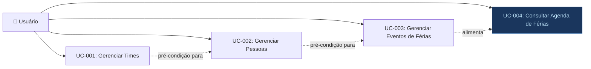

# Casos de Uso — ferias

> **Artefato RUP:** Modelo de Casos de Uso (Requisitos)
> **Proprietário:** [RUP] Analista de Requisitos (📋)
> **Status:** Completo
> **Última atualização:** 2026-07-17

---

## Visão Geral

| ID | Caso de Uso | Ator | Processo |
|----|-------------|------|----------|
| UC-001 | Gerenciar Times | Usuário | BP-01 |
| UC-002 | Gerenciar Pessoas | Usuário | BP-02 |
| UC-003 | Gerenciar Eventos de Férias | Usuário | BP-03 |
| UC-004 | Consultar Agenda de Férias | Usuário | BP-04 |

> **Nota sobre atores:** O sistema possui um único ator — **Usuário** — pois não há diferenciação de papéis (BR-013, BR-014). Qualquer pessoa com acesso à rede local pode executar qualquer caso de uso.

---

## UC-001: Gerenciar Times

**Ator:** Usuário
**Gatilho:** Necessidade de cadastrar um novo time, editar dados de um time existente ou remover um time obsoleto.
**Pré-condições:** O sistema está acessível via navegador.
**Pós-condições:** O time é criado/atualizado/removido no banco de dados.
**Requisitos Relacionados:** RF-01, RF-02, RF-03, RF-04, NFR-01

#### Fluxo Principal — Criar Time
1. Usuário acessa a área de gestão de times
2. Usuário clica em "Criar Time" (ou equivalente)
3. Sistema exibe formulário com campos: nome (obrigatório) e descrição (opcional)
4. Usuário preenche os dados e confirma
5. Sistema persiste o time no banco de dados
6. Sistema exibe o time na listagem atualizada

#### Fluxos Alternativos

- **AF-01: Editar time** — No passo 2, o usuário seleciona um time existente e edita seus dados. Sistema atualiza o registro. (RF-02)
- **AF-02: Excluir time sem vínculos** — No passo 2, o usuário solicita exclusão de um time que não possui pessoas vinculadas. Sistema exclui o time. (RF-03, BR-008)

#### Fluxos de Exceção

- **EF-01: Excluir time com pessoas vinculadas** — Usuário tenta excluir um time que possui pessoas. Sistema rejeita a operação e exibe mensagem informando que as pessoas devem ser removidas ou movidas antes. (BR-010)
- **EF-02: Nome em branco** — Usuário tenta salvar sem preencher o nome. Sistema exibe erro de validação.

---

## UC-002: Gerenciar Pessoas

**Ator:** Usuário
**Gatilho:** Necessidade de cadastrar um novo membro, atualizar seus dados ou remover uma pessoa do sistema.
**Pré-condições:** Existe pelo menos um time cadastrado (para vincular a pessoa).
**Pós-condições:** A pessoa é criada/atualizada/removida no banco de dados. No caso de exclusão, todos os seus eventos de férias são removidos em cascata.
**Requisitos Relacionados:** RF-05, RF-06, RF-07, RF-08, RF-09, RF-10, NFR-01

#### Fluxo Principal — Criar Pessoa
1. Usuário acessa a área de gestão de pessoas
2. Usuário clica em "Criar Pessoa" (ou equivalente)
3. Sistema exibe formulário com campos: nome (obrigatório), email (obrigatório), time (obrigatório — seleção entre times existentes)
4. Usuário preenche os dados e confirma
5. Sistema valida unicidade do email (BR-011)
6. Sistema valida que um time foi selecionado (BR-001)
7. Sistema persiste a pessoa no banco de dados
8. Sistema exibe a pessoa na listagem atualizada

#### Fluxos Alternativos

- **AF-01: Editar pessoa** — No passo 2, o usuário seleciona uma pessoa existente e edita seus dados (nome, email, time). Sistema revalida unicidade do email e persiste. (RF-07)
- **AF-02: Excluir pessoa** — No passo 2, o usuário solicita exclusão. Sistema exclui a pessoa e todos os seus eventos de férias em cascata (UQ-002, BR-009). Sistema confirma a ação antes de executar. (RF-08)

#### Fluxos de Exceção

- **EF-01: Email duplicado** — No passo 5, o sistema detecta que o email já está em uso por outra pessoa. Operação rejeitada com mensagem de erro. (BR-011)
- **EF-02: Nenhum time disponível** — No passo 3, não existem times cadastrados. Sistema orienta o usuário a cadastrar um time primeiro.
- **EF-03: Campos obrigatórios em branco** — Usuário tenta salvar sem preencher nome, email ou time. Sistema exibe erro de validação.

---

## UC-003: Gerenciar Eventos de Férias

**Ator:** Usuário
**Gatilho:** Uma pessoa do time vai tirar férias e o período precisa ser registrado, ou um evento existente precisa ser corrigido/removido.
**Pré-condições:** Existe pelo menos uma pessoa cadastrada no sistema.
**Pós-condições:** O evento de férias é criado/atualizado/removido. Eventos criados/atualizados ficam visíveis na tela inicial.
**Requisitos Relacionados:** RF-11, RF-12, RF-13, RF-14, RF-15, NFR-01

#### Fluxo Principal — Criar Evento de Férias
1. Usuário acessa a área de gestão de férias
2. Usuário clica em "Registrar Férias" (ou equivalente)
3. Sistema exibe formulário com campos: pessoa (seleção — obrigatório), data de início (obrigatório), data de fim (obrigatório), quantidade de dias (obrigatório, preenchimento manual)
4. Usuário preenche os dados e confirma
5. Sistema valida que data de início ≤ data de fim (BR-002)
6. Sistema persiste o evento de férias
7. Evento aparece na tela inicial na posição cronológica correta

#### Fluxos Alternativos

- **AF-01: Editar evento** — No passo 2, o usuário seleciona um evento existente e edita datas/dias. Sistema revalida o período e persiste. (RF-13)
- **AF-02: Excluir evento** — No passo 2, o usuário solicita exclusão de um evento. Sistema remove o registro. (RF-14)
- **AF-03: Cadastrar múltiplos períodos** — Após o passo 7, o usuário repete o fluxo para a mesma pessoa, criando outro evento (férias parceladas). Sistema permite sem restrição. (BR-007, RF-15)

#### Fluxos de Exceção

- **EF-01: Data de início posterior à data de fim** — No passo 5, a validação falha. Sistema exibe erro e impede o cadastro. (BR-002)
- **EF-02: Campos obrigatórios em branco** — Usuário tenta salvar sem preencher todos os campos. Sistema exibe erro de validação.
- **EF-03: Pessoa não encontrada** — Pessoa foi excluída entre o carregamento do formulário e o envio. Sistema rejeita a operação.

---

## UC-004: Consultar Agenda de Férias

**Ator:** Usuário
**Gatilho:** Necessidade de saber quem está ou estará de férias, verificar sobreposições ou planejar entregas.
**Pré-condições:** Nenhuma (a tela inicial é acessível mesmo sem dados).
**Pós-condições:** Nenhuma — consulta não altera estado.
**Requisitos Relacionados:** RF-16, RF-17, RF-18, RF-19, RF-20, NFR-01, NFR-03

#### Fluxo Principal — Visualizar Férias Futuras
1. Usuário acessa a tela inicial do sistema
2. Sistema carrega os eventos de férias com data de fim ≥ hoje (UQ-003)
3. Sistema ordena os eventos por data de início ascendente (BR-004)
4. Sistema exibe cada evento com: nome da pessoa, quantidade de dias, data de início e data de fim (BR-012)
5. O filtro por time exibe "Todos" como padrão (BR-006)

#### Fluxos Alternativos

- **AF-01: Filtrar por time** — No passo 5, o usuário seleciona um time específico no filtro. Sistema recarrega exibindo apenas eventos de pessoas do time selecionado (BR-005). Ao selecionar "Todos", retorna ao comportamento padrão (BR-006). (RF-18)
- **AF-02: Incluir férias passadas** — O usuário ativa o toggle de "mostrar passadas". Sistema recarrega incluindo eventos com data de fim < hoje. (RF-19, UQ-003)
- **AF-03: Identificar sobreposição** — O usuário observa visualmente que dois ou mais membros do mesmo time possuem férias em períodos coincidentes. Não há alerta explícito — a identificação é pelo layout/calendário. (RF-20, UQ-001)

#### Fluxos de Exceção

- **EF-01: Nenhum evento cadastrado** — Sistema exibe mensagem indicando que não há férias registradas, com sugestão de cadastrar.

---

## Matriz de Rastreabilidade — Casos de Uso × Requisitos

| UC | Requisitos Funcionais | Requisitos Não-Funcionais | Regras de Negócio |
|----|----------------------|--------------------------|-------------------|
| UC-001 | RF-01, RF-02, RF-03, RF-04 | NFR-01 | BR-008, BR-010 |
| UC-002 | RF-05, RF-06, RF-07, RF-08, RF-09, RF-10 | NFR-01 | BR-001, BR-009, BR-011 |
| UC-003 | RF-11, RF-12, RF-13, RF-14, RF-15 | NFR-01 | BR-002, BR-003, BR-007 |
| UC-004 | RF-16, RF-17, RF-18, RF-19, RF-20 | NFR-01, NFR-03 | BR-004, BR-005, BR-006, BR-012 |

---

## Diagrama de Casos de Uso

> UC-004 está destacado porque é o caso de uso de maior valor — o objetivo principal do sistema é dar **visibilidade** sobre as férias.
