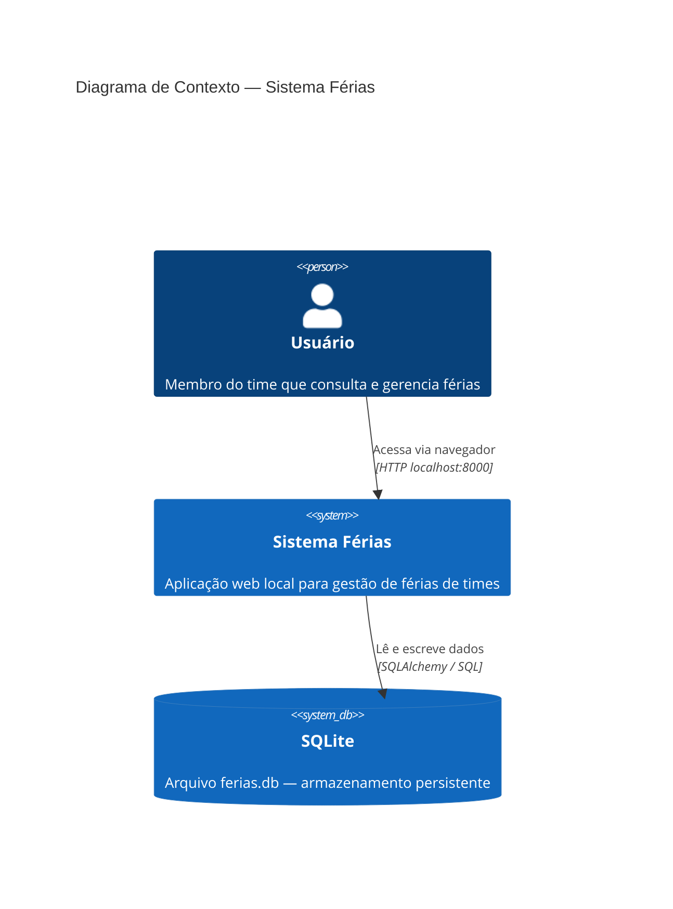
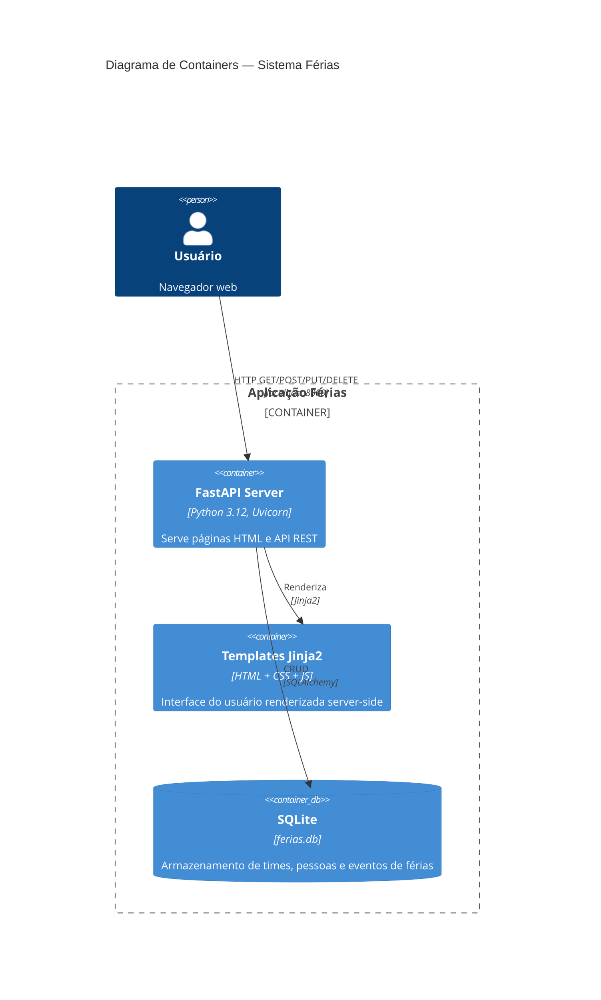
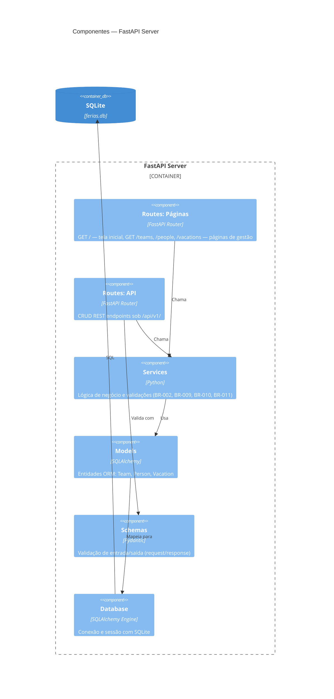

# Arquitetura do Sistema — ferias

> **Artefato RUP:** Documento de Arquitetura (Análise & Design)
> **Proprietário:** [RUP] Arquiteto
> **Status:** Completo
> **Última atualização:** 2026-07-17

---

## 1. Visão Geral

O sistema **ferias** é uma aplicação web monolítica simples para gestão de férias de times de tecnologia. Roda 100% local, sem dependências externas (NFR-05, BR-015).

**Estilo arquitetural:** Monolito em camadas (Layered Architecture) — adequado ao escopo reduzido (~30 usuários, ~100 eventos, 3 entidades). Uma arquitetura hexagonal ou microsserviços seria desproporcional.

**Stack:**
- **Runtime:** Python 3.12
- **Framework web:** FastAPI (async, validação automática via Pydantic)
- **ORM:** SQLAlchemy 2.x (com modelos declarativos)
- **Banco de dados:** SQLite (arquivo único — NFR-06)
- **Templates:** Jinja2 (server-side rendering)
- **Frontend:** HTML + CSS + JavaScript puro (sem frameworks JS)
- **Servidor:** Uvicorn (ASGI, embutido no FastAPI)

---

## 2. Diagrama de Contexto (C4 Nível 1)



> **Nota:** Não há sistemas externos. O sistema é autocontido (NFR-05, BR-015).

---

## 3. Diagrama de Containers (C4 Nível 2)



---

## 4. Diagrama de Componentes (C4 Nível 3)



---

## 5. Decisões Arquiteturais (ADRs)

### ADR-001: Monolito em camadas com FastAPI

- **Status:** Aceito
- **Contexto:** O sistema atende ~30 usuários, possui 3 entidades e sem integrações externas. Precisamos de uma estrutura simples que permita desenvolvimento rápido (NFR-07, AS-01).
- **Decisão:** Adotar um monolito em camadas (routes → services → models) usando FastAPI com SQLAlchemy.
- **Consequências:** Setup simples, deploy trivial (`python main.py`), sem overhead de comunicação entre serviços. Limita escalabilidade horizontal — aceitável dado AS-01.

### ADR-002: SQLite como banco de dados

- **Status:** Aceito
- **Contexto:** O sistema roda 100% local (NFR-05) e deve ser facilmente backup-ável (NFR-06). Volume de dados baixo: ~30 pessoas, ~100 eventos (AS-01, NFR-07).
- **Decisão:** Usar SQLite como banco de dados, armazenado em um único arquivo `ferias.db` na raiz do projeto.
- **Consequências:** Zero configuração de servidor de banco. Backup = copiar 1 arquivo. Não suporta acesso concorrente pesado — aceitável dado o volume. SQLAlchemy abstrai o SQL dialect, permitindo migração futura para PostgreSQL se necessário.

### ADR-003: Server-Side Rendering com Jinja2

- **Status:** Aceito
- **Contexto:** O frontend precisa ser simples, funcionar em navegadores modernos (NFR-04) e sem dependências externas (NFR-05, BR-015). Não há necessidade de SPA (Single Page Application) — o domínio é CRUD puro.
- **Decisão:** Usar Jinja2 templates renderizados pelo FastAPI. HTML/CSS/JS estáticos servidos localmente. Sem React, Vue ou frameworks JS.
- **Consequências:** Simplicidade máxima. Fontes e CSS 100% locais (BR-015). Cada ação do usuário faz um request ao servidor e recebe HTML completo (ou parcial via fetch+replace para UX fluída). Sem build step no frontend.

### ADR-004: API REST interna para operações CRUD

- **Status:** Aceito
- **Contexto:** As páginas Jinja2 precisam submeter dados ao servidor. Podemos usar formulários POST tradicionais ou uma API REST que o JS consume.
- **Decisão:** Expor endpoints REST sob `/api/v1/` para CRUD. As páginas HTML usam `fetch()` para consumir a API, com feedback visual sem recarregar a página inteira.
- **Consequências:** Separação clara entre apresentação (templates) e lógica (API). Permite testar a API independentemente. O JavaScript de cada página faz chamadas `fetch()` à API e atualiza o DOM. Sem framework JS — vanilla JS puro.

### ADR-005: Sem autenticação

- **Status:** Aceito
- **Contexto:** BR-013 e BR-014 estabelecem que não há controle de acesso. NFR-08 confirma como risco aceito.
- **Decisão:** Nenhum middleware de autenticação ou autorização. Todos os endpoints são públicos.
- **Consequências:** Qualquer pessoa na rede local pode criar, editar e excluir dados. Risco conscientemente aceito pelo stakeholder. Se o requisito mudar no futuro, o middleware pode ser adicionado na camada de routes sem alterar services/models.

### ADR-006: Cascata na exclusão de Pessoa, bloqueio na exclusão de Time

- **Status:** Aceito
- **Contexto:** BR-009 determina cascata para exclusão de pessoa (deleta férias junto). BR-010 determina bloqueio para exclusão de time (não pode ter pessoas). São comportamentos DIFERENTES para entidades DIFERENTES.
- **Decisão:** Implementar `ON DELETE CASCADE` na FK vacation → person. Implementar validação na camada de serviço para impedir exclusão de time com pessoas (retorna erro 409).
- **Consequências:** Exclusão de pessoa é limpa — sem órfãos. Exclusão de time exige ação prévia do usuário (mover ou remover pessoas). Consistência garantida no banco.

### ADR-007: RF-20 — Sobreposição visual via highlight na listagem

- **Status:** Aceito
- **Contexto:** RF-20 pede que sobreposições de férias no mesmo time sejam "identificáveis visualmente". A questão levantada no progression.md (UQ-001) é: calendário ou highlight na lista?
- **Decisão:** Usar highlight na listagem (badge ou cor diferenciada nos cards com sobreposição). Não implementar calendário visual.
- **Consequências:** Mais simples que um calendário. A lógica de detecção de sobreposição roda no backend ao montar a tela inicial (query que compara períodos do mesmo time). Cards/linhas com sobreposição recebem uma classe CSS para destaque visual. Um calendário completo seria overkill para ~30 pessoas (AS-01) e poderia ser adicionado no futuro sem mudança de backend.

---

## 6. Camadas da Aplicação

```
┌─────────────────────────────────────────────────────┐
│  Presentation Layer (Templates + Static Assets)     │
│  ├── templates/*.html (Jinja2)                      │
│  ├── static/css/*.css                               │
│  └── static/js/*.js                                 │
├─────────────────────────────────────────────────────┤
│  Routes Layer (FastAPI Routers)                      │
│  ├── routes/pages.py (renderiza templates)           │
│  └── routes/api.py (endpoints REST /api/v1/*)        │
├─────────────────────────────────────────────────────┤
│  Service Layer (Lógica de Negócio)                   │
│  ├── services/team_service.py                        │
│  ├── services/person_service.py                      │
│  └── services/vacation_service.py                    │
├─────────────────────────────────────────────────────┤
│  Data Layer (ORM + Banco)                            │
│  ├── models/team.py                                  │
│  ├── models/person.py                                │
│  ├── models/vacation.py                              │
│  └── database.py (engine, session, create_tables)    │
└─────────────────────────────────────────────────────┘
                         │
                    ┌────▼────┐
                    │ SQLite  │
                    │ferias.db│
                    └─────────┘
```

**Regra de dependência:** Cada camada só conhece a camada imediatamente abaixo. Templates nunca acessam o banco diretamente.

---

## 7. Preocupações Transversais (Cross-Cutting Concerns)

### 7.1 Tratamento de Erros

- Validações de entrada via Pydantic (retorna 422 automaticamente)
- Erros de negócio (e.g., email duplicado, time com pessoas) retornam respostas HTTP semânticas:
  - `409 Conflict` — email duplicado (BR-011), exclusão de time com pessoas (BR-010)
  - `404 Not Found` — entidade não encontrada
  - `422 Unprocessable Entity` — dados inválidos (BR-002)
- Erros internos retornam `500` com mensagem genérica (sem stack trace para o usuário)

### 7.2 Logging

- Logging nativo do Python (`logging` module) com nível configurável
- Cada operação CRUD registra log INFO com entidade e ID afetado
- Erros de negócio registram log WARNING

### 7.3 CORS

- Não aplicável — frontend e backend são o mesmo processo (mesmo origin)

### 7.4 Assets Locais

- Todas as fontes CSS embutidas localmente (BR-015, NFR-05)
- Sem CDN, sem Google Fonts, sem links externos
- Ícones via SVG inline ou caracteres Unicode (sem Font Awesome CDN)

### 7.5 Backup

- Procedimento: copiar o arquivo `ferias.db` (NFR-06)
- Documentar no README do projeto

---

## 8. Rastreabilidade — ADRs × Requisitos

| ADR | Requisitos / Regras |
|-----|---------------------|
| ADR-001 | NFR-07, AS-01 |
| ADR-002 | NFR-05, NFR-06, NFR-07, AS-01 |
| ADR-003 | NFR-04, NFR-05, BR-015 |
| ADR-004 | RF-01 a RF-15 (todos os CRUDs) |
| ADR-005 | BR-013, BR-014, NFR-08 |
| ADR-006 | BR-009, BR-010 |
| ADR-007 | RF-20, UQ-001 |
