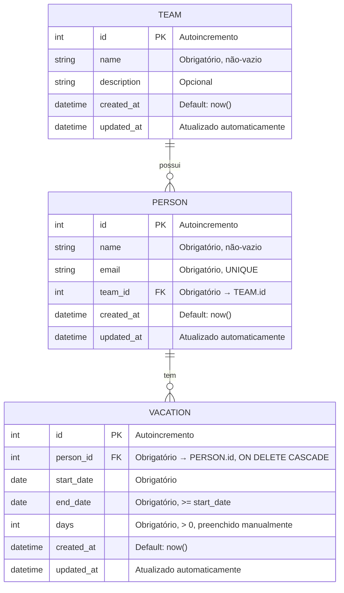

# Modelo de Domínio — ferias

> **Artefato RUP:** Modelo de Domínio (Análise & Design)
> **Proprietário:** [RUP] Arquiteto
> **Status:** Completo
> **Última atualização:** 2026-07-17

---

## 1. Visão Geral

O domínio possui **3 entidades** com relacionamentos simples:

- **Team** — agrupamento organizacional
- **Person** — membro de um time
- **Vacation** — evento de férias de uma pessoa

Não há agregados complexos, value objects ou bounded contexts — o domínio é CRUD direto com validações pontuais.

---

## 2. Diagrama Entidade-Relacionamento



---

## 3. Detalhamento das Entidades

### 3.1 Team (Time)

| Campo | Tipo | Restrições | Regra |
|-------|------|------------|-------|
| id | INTEGER | PK, autoincremento | — |
| name | VARCHAR(100) | NOT NULL, não-vazio | — |
| description | VARCHAR(500) | Nullable | — |
| created_at | DATETIME | NOT NULL, default=now() | — |
| updated_at | DATETIME | NOT NULL, atualizado automaticamente | — |

**Regras de negócio aplicadas:**
- BR-008: Time pode existir sem pessoas vinculadas (sem restrição de mínimo)
- BR-010: Time NÃO pode ser excluído se possuir pessoas vinculadas → validação na camada de serviço, retorna erro 409 (ADR-006)

**Índices:**
- PK em `id`

---

### 3.2 Person (Pessoa)

| Campo | Tipo | Restrições | Regra |
|-------|------|------------|-------|
| id | INTEGER | PK, autoincremento | — |
| name | VARCHAR(150) | NOT NULL, não-vazio | — |
| email | VARCHAR(254) | NOT NULL, UNIQUE | BR-011 |
| team_id | INTEGER | NOT NULL, FK → team.id | BR-001 |
| created_at | DATETIME | NOT NULL, default=now() | — |
| updated_at | DATETIME | NOT NULL, atualizado automaticamente | — |

**Regras de negócio aplicadas:**
- BR-001: Toda pessoa deve estar vinculada a exatamente um time → `team_id NOT NULL`
- BR-011: Email único → constraint `UNIQUE(email)`
- BR-009: Exclusão de pessoa faz cascata nas férias → `ON DELETE CASCADE` na FK reversa em Vacation (ADR-006)

**Índices:**
- PK em `id`
- UNIQUE em `email`
- INDEX em `team_id` (FK, usado em JOINs e filtros)

---

### 3.3 Vacation (Evento de Férias)

| Campo | Tipo | Restrições | Regra |
|-------|------|------------|-------|
| id | INTEGER | PK, autoincremento | — |
| person_id | INTEGER | NOT NULL, FK → person.id, ON DELETE CASCADE | BR-009 |
| start_date | DATE | NOT NULL | — |
| end_date | DATE | NOT NULL, >= start_date | BR-002 |
| days | INTEGER | NOT NULL, > 0 | BR-003 |
| created_at | DATETIME | NOT NULL, default=now() | — |
| updated_at | DATETIME | NOT NULL, atualizado automaticamente | — |

**Regras de negócio aplicadas:**
- BR-002: `start_date <= end_date` → validação no Pydantic schema E check constraint no banco
- BR-003: `days` é informado manualmente, sem cálculo automático
- BR-007: Uma pessoa pode ter múltiplos eventos → relação 1:N sem restrição de quantidade
- BR-009: `ON DELETE CASCADE` em `person_id` — exclusão de pessoa remove automaticamente todos os eventos

**Índices:**
- PK em `id`
- INDEX em `person_id` (FK, usado em JOINs)
- INDEX em `start_date` (usado na ordenação da tela inicial — BR-004)
- INDEX em `end_date` (usado no filtro futuras/passadas — RF-19)

---

## 4. Constraints de Integridade no Banco

```sql
-- Team: sem constraints especiais além do PK

-- Person
FOREIGN KEY (team_id) REFERENCES team(id)  -- BR-001 / sem cascade (BR-010)
UNIQUE (email)                              -- BR-011

-- Vacation
FOREIGN KEY (person_id) REFERENCES person(id) ON DELETE CASCADE  -- BR-009
CHECK (start_date <= end_date)                                    -- BR-002
CHECK (days > 0)                                                  -- BR-003
```

> **Nota sobre BR-010:** A FK `person.team_id → team.id` intencionalmente NÃO usa `ON DELETE CASCADE`. A exclusão de time com pessoas é impedida na camada de serviço (retorna 409). Se quiséssemos proteger no banco, usaríamos `ON DELETE RESTRICT` — mas a validação no service é suficiente e dá mensagem de erro mais amigável.

---

## 5. Lógica de Sobreposição (RF-20)

A detecção de sobreposição é uma **query**, não uma entidade. Dois eventos de férias se sobrepõem quando:

```
evento_a.start_date <= evento_b.end_date
AND evento_a.end_date >= evento_b.start_date
AND evento_a.person.team_id == evento_b.person.team_id
AND evento_a.person_id != evento_b.person_id
```

Essa lógica roda na camada de serviço ao montar a tela inicial. O resultado é um conjunto de `vacation_ids` que possuem sobreposição. O template Jinja2 aplica uma classe CSS de destaque nesses cards (ADR-007).

---

## 6. Mapeamento SQLAlchemy (Esquema Conceitual)

```python
# models/team.py
class Team(Base):
    __tablename__ = "team"
    id = Column(Integer, primary_key=True, autoincrement=True)
    name = Column(String(100), nullable=False)
    description = Column(String(500), nullable=True)
    created_at = Column(DateTime, default=func.now(), nullable=False)
    updated_at = Column(DateTime, default=func.now(), onupdate=func.now(), nullable=False)
    persons = relationship("Person", back_populates="team")

# models/person.py
class Person(Base):
    __tablename__ = "person"
    id = Column(Integer, primary_key=True, autoincrement=True)
    name = Column(String(150), nullable=False)
    email = Column(String(254), nullable=False, unique=True)
    team_id = Column(Integer, ForeignKey("team.id"), nullable=False)
    created_at = Column(DateTime, default=func.now(), nullable=False)
    updated_at = Column(DateTime, default=func.now(), onupdate=func.now(), nullable=False)
    team = relationship("Team", back_populates="persons")
    vacations = relationship("Vacation", back_populates="person", cascade="all, delete-orphan")

# models/vacation.py
class Vacation(Base):
    __tablename__ = "vacation"
    id = Column(Integer, primary_key=True, autoincrement=True)
    person_id = Column(Integer, ForeignKey("person.id", ondelete="CASCADE"), nullable=False)
    start_date = Column(Date, nullable=False)
    end_date = Column(Date, nullable=False)
    days = Column(Integer, nullable=False)
    created_at = Column(DateTime, default=func.now(), nullable=False)
    updated_at = Column(DateTime, default=func.now(), onupdate=func.now(), nullable=False)
    person = relationship("Person", back_populates="vacations")
    __table_args__ = (
        CheckConstraint("start_date <= end_date", name="ck_vacation_dates"),
        CheckConstraint("days > 0", name="ck_vacation_days_positive"),
    )
```

> **Nota:** Este é o esquema conceitual para guiar a implementação. O código final pode ajustar imports e convenções do projeto.

---

## 7. Rastreabilidade — Modelo × Regras de Negócio

| BR | Implementação no Modelo |
|----|------------------------|
| BR-001 | `person.team_id` NOT NULL, FK → team.id |
| BR-002 | CHECK constraint `start_date <= end_date` + validação Pydantic |
| BR-003 | `vacation.days` é campo de entrada, sem cálculo |
| BR-007 | Relação 1:N person → vacation sem restrição de quantidade |
| BR-008 | Nenhuma restrição mínima de persons em team |
| BR-009 | `ON DELETE CASCADE` na FK vacation.person_id |
| BR-010 | Validação no service (não no banco) — impede exclusão de time com pessoas |
| BR-011 | UNIQUE constraint em `person.email` |
