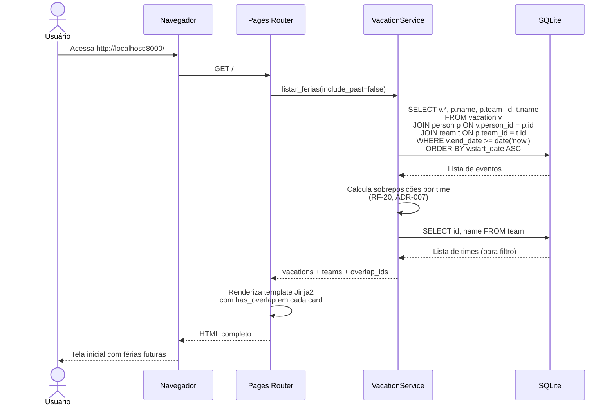
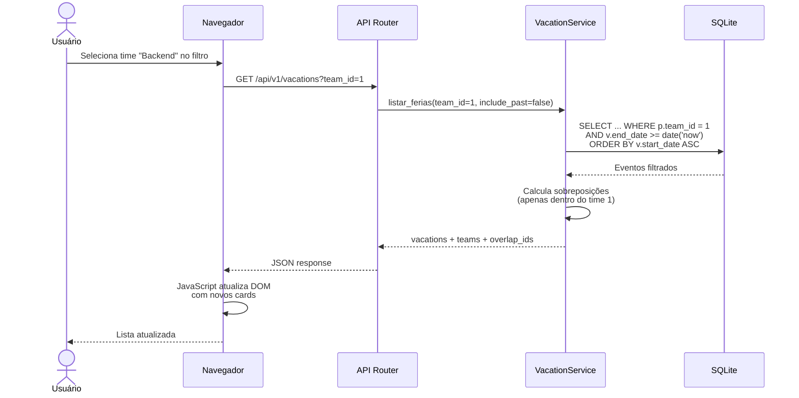
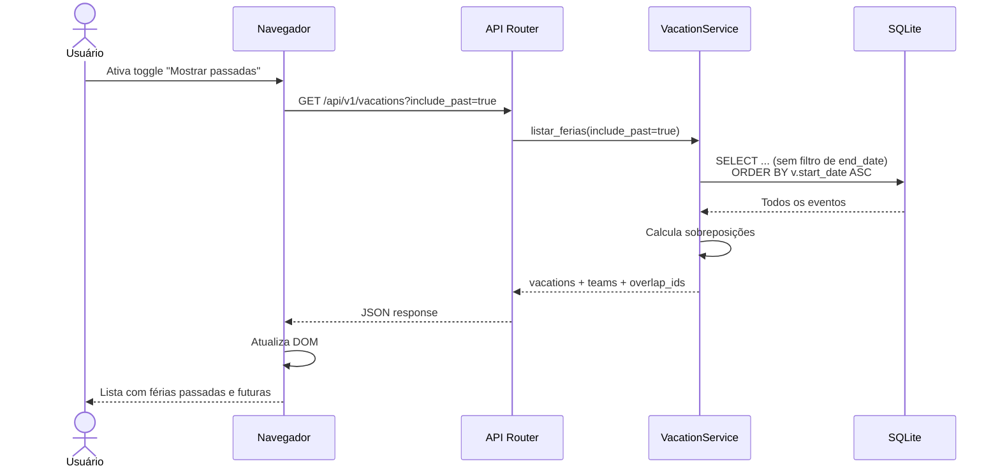
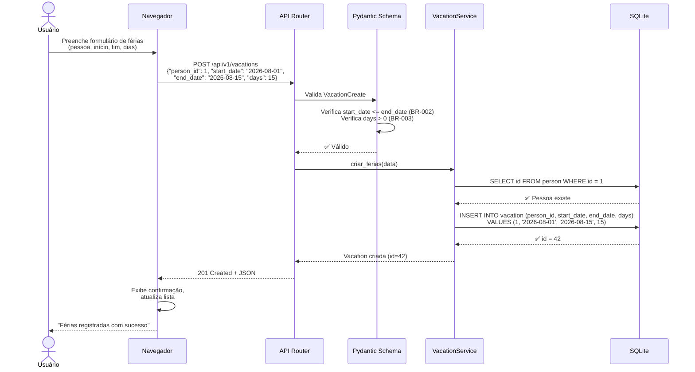
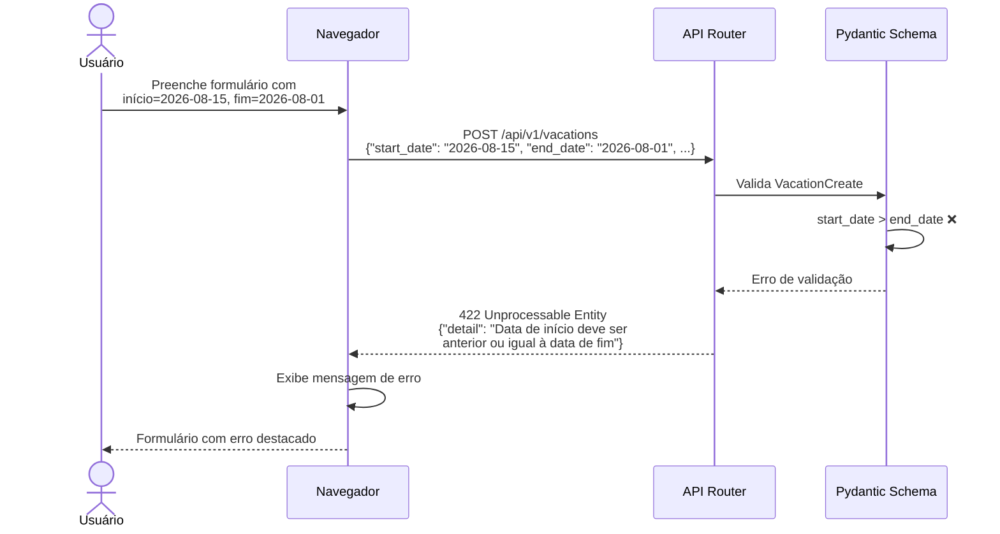
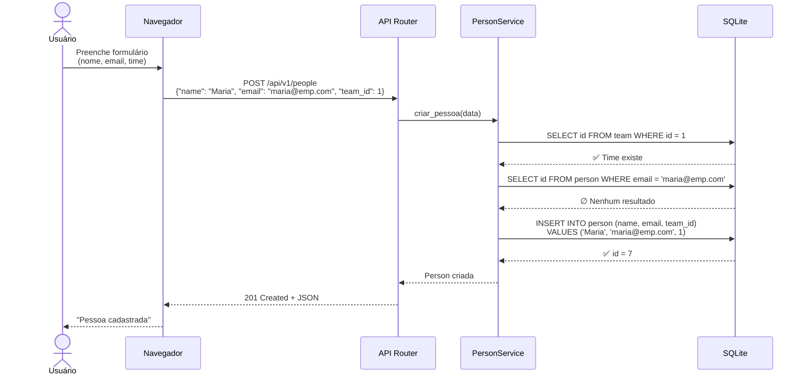
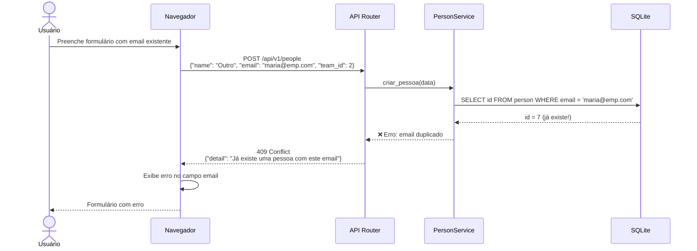
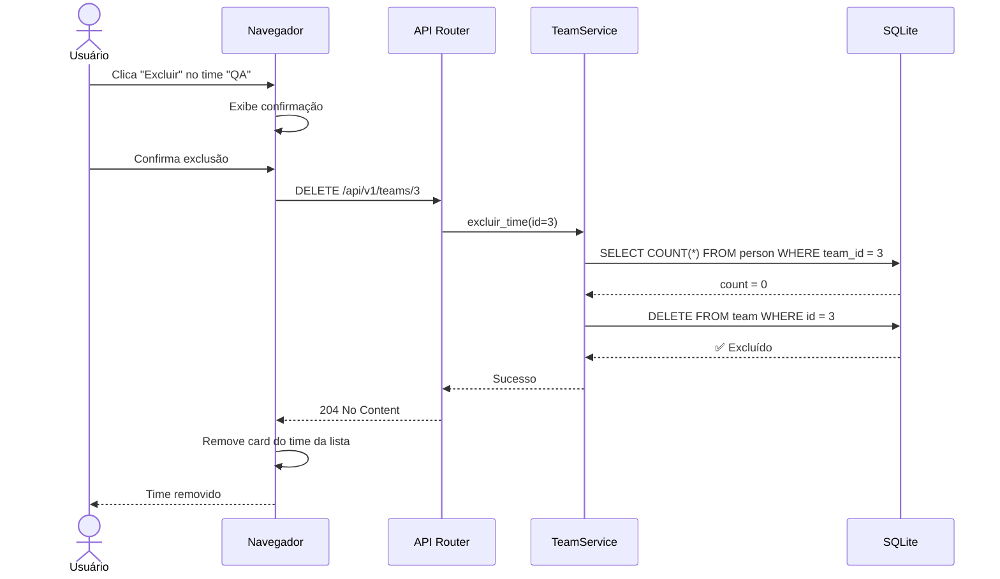
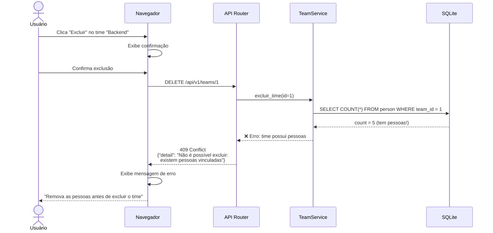
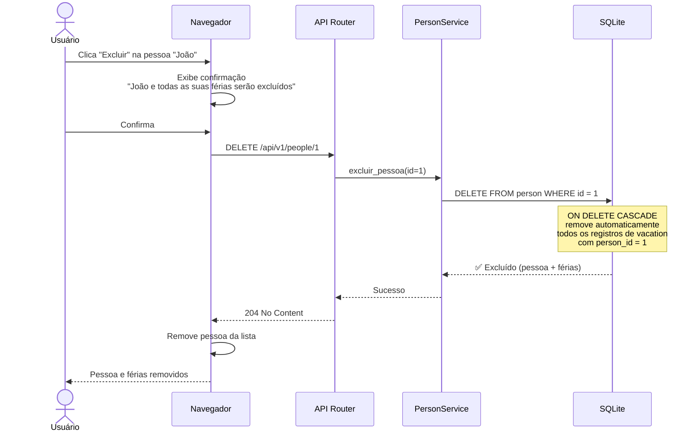

# Diagramas de Sequência — ferias

> **Artefato RUP:** Diagramas de Sequência (Análise & Design)
> **Proprietário:** [RUP] Arquiteto
> **Status:** Completo
> **Última atualização:** 2026-07-17

---

## 1. UC-004: Consultar Agenda de Férias (Tela Inicial)

O fluxo principal do sistema — carrega a tela inicial com férias futuras, filtro por time e detecção de sobreposição.

### 1.1 Fluxo Alternativo — Filtrar por Time (RF-18)

### 1.2 Fluxo Alternativo — Toggle Férias Passadas (RF-19)

---

## 2. UC-003: Criar Evento de Férias (Happy Path)

### 2.1 Fluxo de Exceção — Data Inválida (BR-002)

---

## 3. UC-002: Criar Pessoa (Happy Path + Exceção)

### 3.1 Fluxo de Exceção — Email Duplicado (BR-011)

---

## 4. UC-001: Excluir Time (Happy Path + Exceção BR-010)

### 4.1 Fluxo de Exceção — Time com Pessoas (BR-010)

---

## 5. UC-002: Excluir Pessoa com Cascata (BR-009)

---

## 6. Resumo de Cobertura

| UC | Diagramas | Fluxos Cobertos |
|----|-----------|-----------------|
| UC-001 | §4, §4.1 | Excluir time (happy path + BR-010) |
| UC-002 | §3, §3.1, §5 | Criar pessoa (happy + email duplicado), Excluir com cascata |
| UC-003 | §2, §2.1 | Criar férias (happy + data inválida) |
| UC-004 | §1, §1.1, §1.2 | Tela inicial, filtro por time, toggle passadas |
