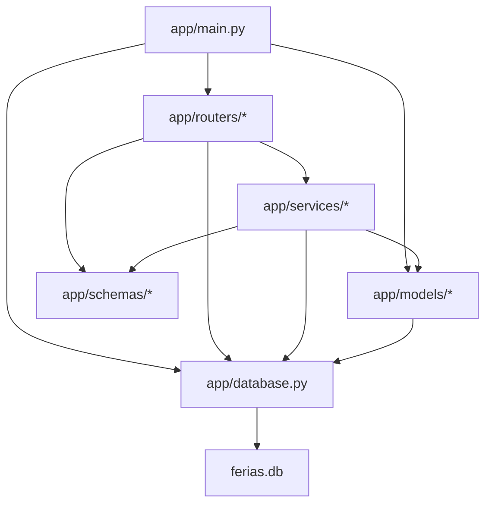

# Mapa de Dependências — ferias

> **Artefato RUP:** Mapa de Dependências (Implementação)
> **Proprietário:** [RUP] Desenvolvedor
> **Status:** Completo
> **Última atualização:** 2026-07-18

---

## 1. Dependências de Build (requirements.txt)

### Runtime

| Pacote | Versão | Propósito |
|--------|--------|-----------|
| `fastapi` | >=0.115, <1.0 | Framework web ASGI |
| `uvicorn[standard]` | >=0.30, <1.0 | Servidor ASGI (inclui uvloop + httptools) |
| `sqlalchemy` | >=2.0, <3.0 | ORM para SQLite |
| `jinja2` | >=3.1, <4.0 | Engine de templates HTML |
| `python-multipart` | >=0.0.9 | Parsing de form data |

### Desenvolvimento

| Pacote | Versão | Propósito |
|--------|--------|-----------|
| `pytest` | >=8.0, <9.0 | Framework de testes |
| `httpx` | >=0.27, <1.0 | HTTP client (TestClient) |
| `pytest-cov` | >=5.0, <6.0 | Relatório de cobertura |
| `ruff` | >=0.5, <1.0 | Linter e formatter |

## 2. Dependências Runtime

| Componente | Tipo | Detalhes |
|------------|------|----------|
| SQLite 3 | Banco embutido | Arquivo `ferias.db`, zero config |
| Python 3.12+ | Runtime | Requer type hints modernos (`X \| None`) |

**Nenhuma dependência externa:** sem SDK de cloud, sem cache, sem message broker, sem serviço remoto.

## 3. Diagrama de Dependências Internas

