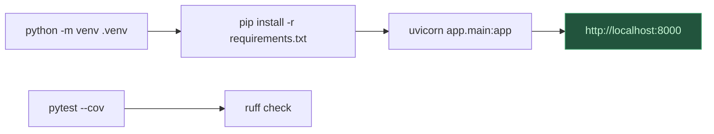

# Pipeline de Build e Execução — ferias

> **Artefato RUP:** Pipeline CI/CD (Deployment)
> **Proprietário:** [RUP] Arquiteto
> **Status:** Completo
> **Última atualização:** 2026-07-17

---

## 1. Visão Geral

O sistema roda 100% local (NFR-05). Não há CI/CD em cloud, container registry ou deploy remoto. O "pipeline" é o fluxo local de setup, execução e testes.

---

## 2. Pré-requisitos

| Ferramenta | Versão | Propósito |
|------------|--------|-----------|
| Python | 3.12+ | Runtime |
| pip | (incluído) | Gerenciador de pacotes |
| Navegador moderno | Chrome/Firefox/Safari/Edge | Interface do usuário (NFR-04) |

> Nenhuma outra dependência de sistema: sem Docker, sem Node.js, sem banco de dados externo.

---

## 3. Setup do Projeto

```bash
# 1. Clonar o repositório (ou criar diretório)
cd /Users/ricardo.costa/Projetos/ferias

# 2. Criar ambiente virtual
python3 -m venv .venv

# 3. Ativar ambiente virtual
source .venv/bin/activate  # macOS/Linux
# .venv\Scripts\activate   # Windows

# 4. Instalar dependências
pip install -r requirements.txt
```

---

## 4. Execução

```bash
# Rodar o servidor
python -m app.main

# ou diretamente com Uvicorn
uvicorn app.main:app --host 0.0.0.0 --port 8000 --reload
```

O servidor inicia em `http://localhost:8000`.

Na primeira execução, o SQLAlchemy cria automaticamente o arquivo `ferias.db` e as tabelas (se não existirem).

### Variáveis de Ambiente (opcionais)

| Variável | Padrão | Descrição |
|----------|--------|-----------|
| `DATABASE_URL` | `sqlite:///ferias.db` | Caminho do banco SQLite |
| `HOST` | `0.0.0.0` | Host do servidor |
| `PORT` | `8000` | Porta do servidor |
| `LOG_LEVEL` | `info` | Nível de log (debug, info, warning, error) |

---

## 5. Testes

```bash
# Rodar todos os testes
pytest

# Com cobertura
pytest --cov=app --cov-report=term-missing

# Apenas testes de um módulo
pytest tests/test_team_service.py -v
```

### Estratégia de Testes

| Camada | Framework | O que testar |
|--------|-----------|-------------|
| Services | pytest | Regras de negócio (BR-002, BR-009, BR-010, BR-011) |
| API | pytest + httpx (TestClient) | Endpoints REST (status codes, payloads) |
| Models | pytest | Constraints, relationships, cascata |

> Banco de teste: SQLite em memória (`sqlite:///:memory:`) — cada teste suite cria/destrói o schema.

---

## 6. Qualidade

```bash
# Linting
ruff check app/ tests/

# Formatação
ruff format app/ tests/

# Type checking (opcional)
mypy app/
```

---

## 7. Backup

```bash
# Backup do banco de dados (NFR-06)
cp ferias.db ferias_backup_$(date +%Y%m%d_%H%M%S).db
```

---

## 8. Fluxo Resumido


