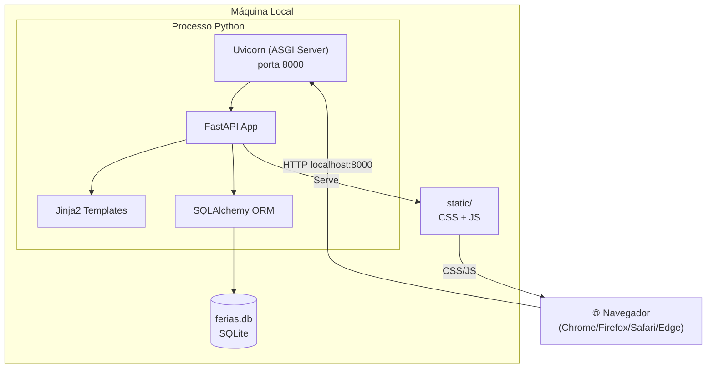

# Infraestrutura do Projeto — ferias

> **Artefato RUP:** Infraestrutura e Estrutura de Projeto (Deployment)
> **Proprietário:** [RUP] Arquiteto
> **Status:** Completo
> **Última atualização:** 2026-07-17

---

## 1. Visão Geral

Projeto 100% local, sem serviços externos (NFR-05, BR-015). A "infraestrutura" é a máquina do desenvolvedor/usuário.

| Componente | Tecnologia | Justificativa |
|------------|------------|---------------|
| Runtime | Python 3.12 | Stack definida (R-02) |
| Framework | FastAPI + Uvicorn | Async, validação via Pydantic, lightweight |
| ORM | SQLAlchemy 2.x | Declarative models, suporte SQLite nativo |
| Banco | SQLite (arquivo `ferias.db`) | Zero config, backup = 1 arquivo (NFR-06) |
| Templates | Jinja2 | Server-side rendering, embutido no FastAPI |
| Frontend | HTML + CSS + JS puro | Sem build step, sem dependências (BR-015) |

---

## 2. Estrutura de Diretórios

```
ferias/
├── app/                          # Código-fonte da aplicação
│   ├── __init__.py
│   ├── main.py                   # Entry point — cria app FastAPI, inclui routers
│   ├── database.py               # Engine, SessionLocal, Base, create_tables()
│   ├── config.py                 # Settings (DATABASE_URL, HOST, PORT, LOG_LEVEL)
│   │
│   ├── models/                   # SQLAlchemy ORM models
│   │   ├── __init__.py
│   │   ├── team.py               # Team
│   │   ├── person.py             # Person
│   │   └── vacation.py           # Vacation
│   │
│   ├── schemas/                  # Pydantic schemas (request/response)
│   │   ├── __init__.py
│   │   ├── team.py               # TeamCreate, TeamResponse
│   │   ├── person.py             # PersonCreate, PersonResponse
│   │   └── vacation.py           # VacationCreate, VacationResponse, VacationListResponse
│   │
│   ├── services/                 # Lógica de negócio
│   │   ├── __init__.py
│   │   ├── team_service.py       # CRUD + validação BR-010
│   │   ├── person_service.py     # CRUD + validação BR-011
│   │   └── vacation_service.py   # CRUD + validação BR-002 + sobreposição RF-20
│   │
│   ├── routes/                   # FastAPI routers
│   │   ├── __init__.py
│   │   ├── pages.py              # GET / , /teams, /people, /vacations (Jinja2)
│   │   └── api.py                # /api/v1/* (REST JSON)
│   │
│   ├── templates/                # Jinja2 HTML templates
│   │   ├── base.html             # Layout base (head, nav, footer)
│   │   ├── index.html            # Tela inicial — agenda de férias (UC-004)
│   │   ├── teams.html            # Gestão de times (UC-001)
│   │   ├── people.html           # Gestão de pessoas (UC-002)
│   │   └── vacations.html        # Gestão de férias (UC-003)
│   │
│   └── static/                   # Assets estáticos (servidos localmente — BR-015)
│       ├── css/
│       │   └── style.css         # Estilos da aplicação (fontes embutidas)
│       └── js/
│           └── app.js            # JavaScript vanilla (fetch API, DOM updates)
│
├── tests/                        # Testes automatizados
│   ├── __init__.py
│   ├── conftest.py               # Fixtures: db em memória, TestClient
│   ├── test_team_service.py
│   ├── test_person_service.py
│   ├── test_vacation_service.py
│   └── test_api.py               # Testes de integração dos endpoints
│
├── spec/                         # Documentação SDD (artefatos RUP)
│   └── docs/
│       ├── 00-overview/
│       ├── 01-business/
│       ├── 02-requirements/
│       ├── 03-design/
│       ├── 04-implementation/
│       ├── 05-test/
│       ├── 06-deployment/
│       └── 07-change-management/
│
├── requirements.txt              # Dependências Python
├── ferias.db                     # Banco de dados SQLite (criado na 1ª execução)
├── .gitignore                    # Ignora .venv/, ferias.db, __pycache__/
└── README.md                     # Documentação do usuário
```

---

## 3. Dependências Python

### requirements.txt

```
fastapi>=0.115,<1.0
uvicorn[standard]>=0.30,<1.0
sqlalchemy>=2.0,<3.0
jinja2>=3.1,<4.0
python-multipart>=0.0.9

# Desenvolvimento e testes
pytest>=8.0,<9.0
httpx>=0.27,<1.0
pytest-cov>=5.0,<6.0
ruff>=0.5,<1.0
```

| Pacote | Propósito |
|--------|-----------|
| `fastapi` | Framework web ASGI |
| `uvicorn[standard]` | Servidor ASGI (inclui uvloop e httptools) |
| `sqlalchemy` | ORM para SQLite |
| `jinja2` | Engine de templates HTML |
| `python-multipart` | Parsing de form data (necessário para formulários) |
| `pytest` | Framework de testes |
| `httpx` | HTTP client usado pelo `TestClient` do FastAPI |
| `pytest-cov` | Relatório de cobertura |
| `ruff` | Linter e formatter Python |

> **Total de dependências runtime:** 5 pacotes. Sem SDK de cloud, sem ORM pesado, sem cache externo.

---

## 4. Banco de Dados

- **Tipo:** SQLite 3
- **Arquivo:** `ferias.db` na raiz do projeto
- **Criação:** Automática na primeira execução via `SQLAlchemy Base.metadata.create_all()`
- **Backup:** Copiar o arquivo (NFR-06)
- **Tamanho estimado:** < 1MB para ~30 pessoas e ~100 eventos (AS-01)

### Schema SQL (gerado pelo SQLAlchemy)

```sql
CREATE TABLE team (
    id INTEGER PRIMARY KEY AUTOINCREMENT,
    name VARCHAR(100) NOT NULL,
    description VARCHAR(500),
    created_at DATETIME NOT NULL DEFAULT (datetime('now')),
    updated_at DATETIME NOT NULL DEFAULT (datetime('now'))
);

CREATE TABLE person (
    id INTEGER PRIMARY KEY AUTOINCREMENT,
    name VARCHAR(150) NOT NULL,
    email VARCHAR(254) NOT NULL UNIQUE,
    team_id INTEGER NOT NULL REFERENCES team(id),
    created_at DATETIME NOT NULL DEFAULT (datetime('now')),
    updated_at DATETIME NOT NULL DEFAULT (datetime('now'))
);

CREATE INDEX ix_person_team_id ON person(team_id);

CREATE TABLE vacation (
    id INTEGER PRIMARY KEY AUTOINCREMENT,
    person_id INTEGER NOT NULL REFERENCES person(id) ON DELETE CASCADE,
    start_date DATE NOT NULL,
    end_date DATE NOT NULL,
    days INTEGER NOT NULL CHECK (days > 0),
    created_at DATETIME NOT NULL DEFAULT (datetime('now')),
    updated_at DATETIME NOT NULL DEFAULT (datetime('now')),
    CHECK (start_date <= end_date)
);

CREATE INDEX ix_vacation_person_id ON vacation(person_id);
CREATE INDEX ix_vacation_start_date ON vacation(start_date);
CREATE INDEX ix_vacation_end_date ON vacation(end_date);
```

---

## 5. .gitignore

```
# Python
__pycache__/
*.pyc
.venv/
*.egg-info/

# Banco de dados
ferias.db
ferias_backup_*.db

# IDE
.idea/
.vscode/
*.swp

# OS
.DS_Store
Thumbs.db

# Testes
.coverage
htmlcov/
.pytest_cache/

# Ruff
.ruff_cache/
```

---

## 6. Diagrama de Deploy



> **Nota:** Tudo roda em um único processo Python. Sem reverse proxy, sem load balancer, sem container. Proporcional ao escopo (AS-01, NFR-07).
